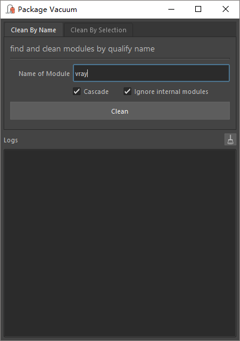
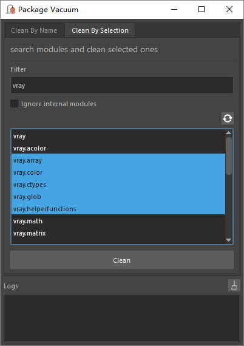

<center>

</center>

# Package Vacuum

`package_vacuum` is a python developing utility for maya. This tool can search, locate and remove python packages in current python runtime environment, in which case you can import modified modules without manually call `reload` or restart Maya.

## Instructions

### Install & Launch

To install this tool, put the *package_vacuum* directory under Maya's script directory.

You can run the following script in script editor to save the launch script to shelf:

```python
import package_vacuum
package_vacuum.saveToShelf()
```

You can also start this tool manually by the following script:

```python
import package_vacuum
w = package_vacuum.showToolWindow()
```

### How to use

There are two different methods to locate the packages.

In *Clean by Name* mode, you can type in the top namespace of the module you want to remove.



The term *top namespace* means a prefix in python module path that leads to a solid module. For example:

```
mymodule        -> ok
mymodule.ui     -> ok
mymod           -> invalid
mymodule.u      -> invalid
mymodule.       -> invalid
```

* __Name of Module__: the top namespace.
* __Cascade__: remove cache of any module/package belongs to the specified namespace, otherwise remove the top module only.
* __Ignore internal modules__: don't remove cache of module/package found under Maya application directory.

----------

In *Clean by Selection* mode, you can filter module/packages by arbitrary key string and select which one(s) you want to remove.



* __Filter__: key string to filter module/packages.
* __Ignore internal modules__: don't remove cache of module/package found under Maya application directory.

The list below will update autamatically to show module/packages meet current conditions. The list itself supports all necessary selection operations:

* LMB click: select one item
* \<Ctrl\> + LMB click: add to selection
* \<Shift\> + LMB click: range selection
* \<Ctrl\> + A: select all
* \<Ctrl\> + I: invert selection